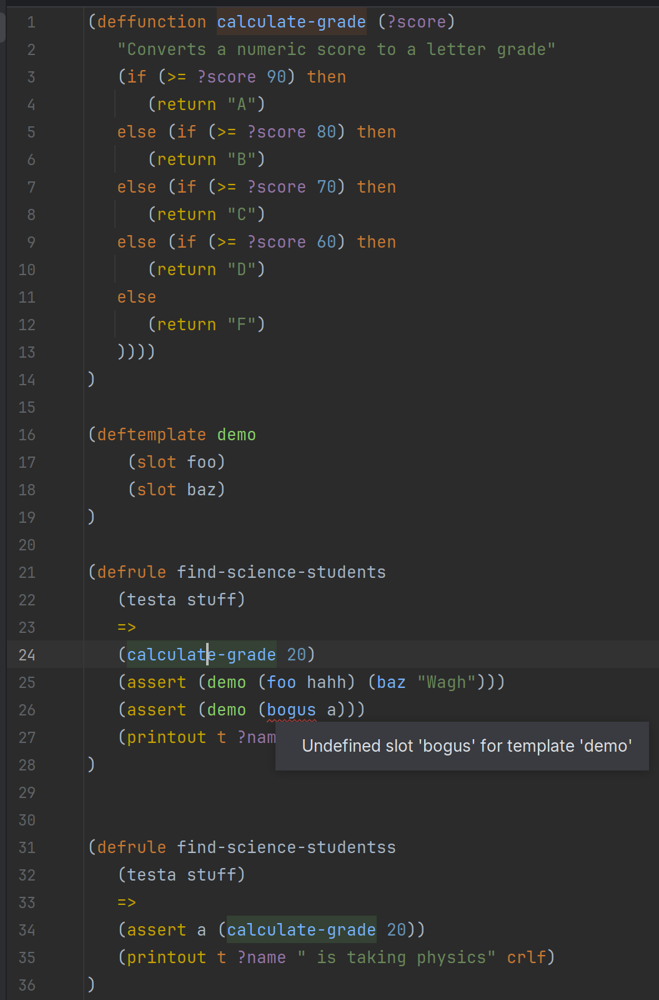

# CLIPS Language Support for IntelliJ

This plugin provides comprehensive language support for the [CLIPS](https://www.clipsrules.net/) (C Language Integrated Production System) expert system language in IntelliJ-based IDEs.

This plugin has been a quick weekend project to get CLIPS support in my IDE, as it's a technology I'm using at work. A significant portion of this was written by JetBrains' Junie, both to get familiar with the tool and get the IDEA plugin API's boilerplate out of the way. Some major features are implemented, like a (mostly complete) lexer/parser, highlighting variables in the same scope, going to the source of local variables, and some more. Significant improvements will be underway to make this more usable and cleaner.

An example of syntax highlighting:



## What is CLIPS?


CLIPS (C Language Integrated Production System) is a powerful, rule-based programming language developed by NASA, primarily used for building expert systems. It allows developers to model knowledge and logic using a declarative, heuristic approach rather than a traditional algorithmic one. In CLIPS, you define a set of rules, and its inference engine determines which rules to fire based on the current facts, making it highly effective for complex decision-making tasks.

For example, a simple rule to monitor a temperature might look like this:

```clp
(defrule temperature-is-high
   ?f <- (temperature-reading (value ?t&:(> ?t 90)))
   =>
   (printout t "Warning: Temperature is high at " ?t " degrees!" crlf)
   (assert (overheating-status active)))
```

CLIPS has its own dedicated [IDE](https://sourceforge.net/projects/clipsrules/files/CLIPS/6.40/), however when it's being integrated with a larger project, native support in an existing IDE is extremely helpful.

## Installation

### Manual Installation
1. Download the plugin ZIP file from the [Releases](https://github.com/yourusername/clips-intellij-plugin/releases) page
2. Open IntelliJ IDEA
3. Go to Settings/Preferences → Plugins
4. Click the gear icon and select "Install Plugin from Disk..."
5. Select the downloaded ZIP file
6. Restart the IDE

## Usage

### File Association
The plugin automatically associates files with the `.clp` extension with the CLIPS language.

### Creating CLIPS Files
1. Right-click on a directory in the Project view
2. Select New → File
3. Enter a name with the `.clp` extension
4. Start writing CLIPS code with syntax highlighting and code completion

## Development

This plugin is built using the IntelliJ Platform SDK. To build from source:

1. Clone the repository
2. Open the project in IntelliJ IDEA
3. Build the project using Gradle:
   ```
   ./gradlew buildPlugin
   ```
4. The plugin ZIP file will be generated in the `build/distributions` directory
